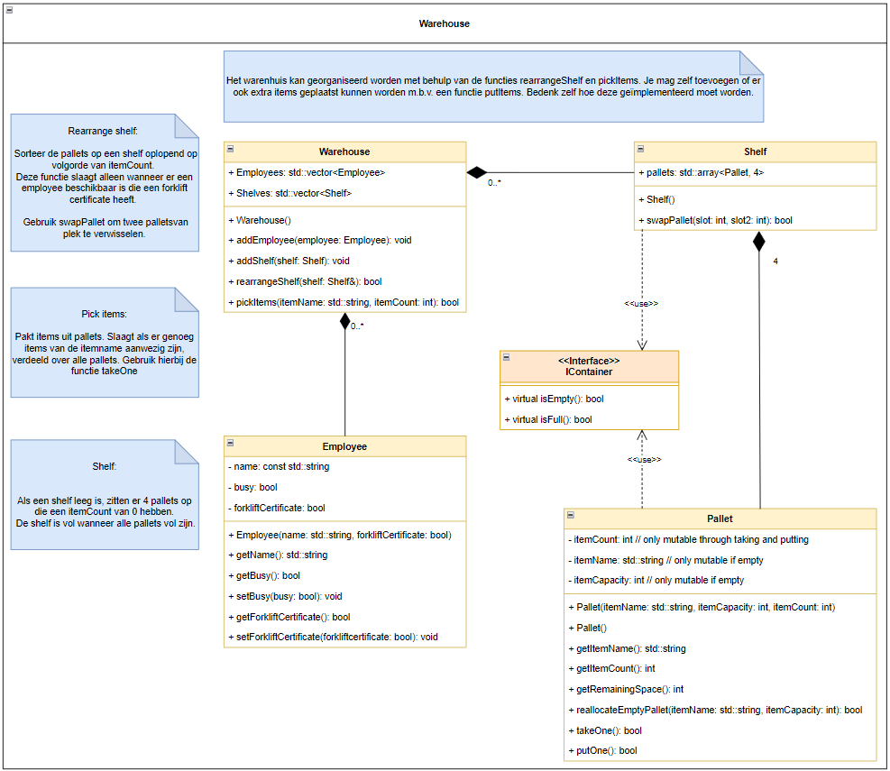

# Warehouse

## About
This is code is an application of the UML below and was comissioned for the Hogeschool Utrecht, university of applied sciences. All classes shown in this image have been reconstructed with their associated attributes and methods.

## How to run
To run the program in VScode, you need to set the build target to `all` and the launch target to `test` on the Makefile tab on the left hand side of the interface. 
If you prefer to run the program from the commandline, make sure you are in the right directory and type in `mingw32-make all`.